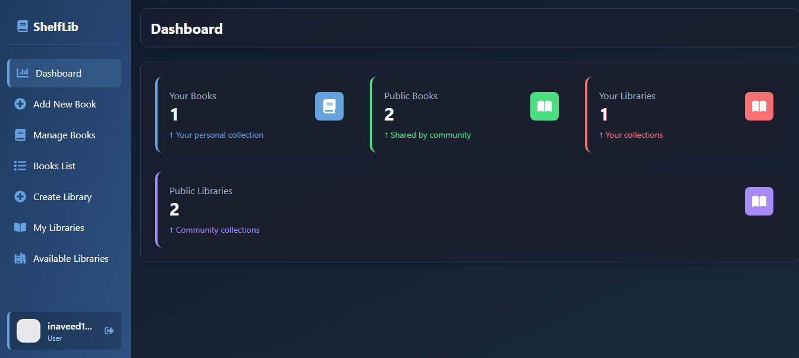
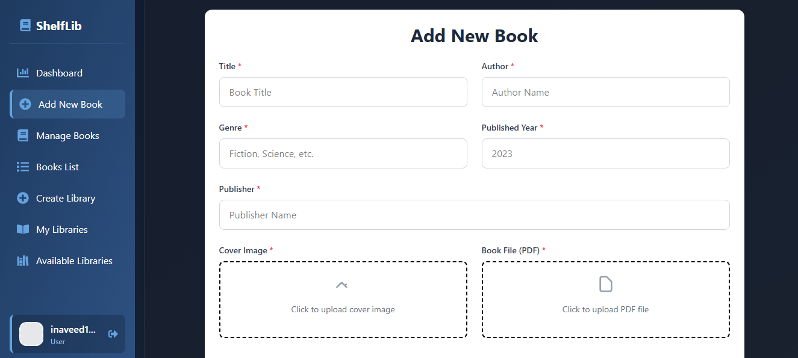
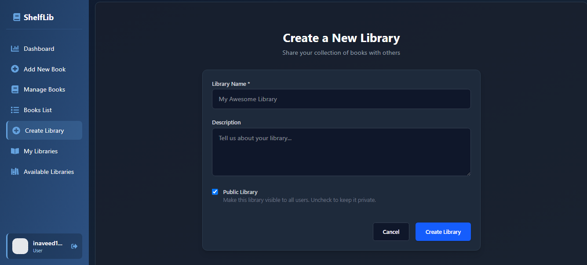

# 📚 MyShelf Library System

This is a **full-stack AI-powered book library system** built using **TypeScript**. It allows users to upload and manage books, organize them into libraries, and control access levels. The project features a modern admin dashboard, file uploads to **Cloudinary**, and secure user authentication.

---


## 📸 Screenshots






---

## ✅ Features

### ✅ Book Management

* Upload book files (PDFs) and cover images
* Uploads handled with **Cloudinary**
* File cleanup handled after upload
* Secure access: only owners can download private books

### ✅ Library Management

* Users can create private/public libraries
* Add books to multiple libraries
* Retrieve public libraries
* Access public library details 
* Download Specific File from Library

### ✅ Authentication & Authorization

* User authentication is required to access and manage personal content
* Public/private control over books and libraries
* Admin-only access to manage specific resources

### ✅ Dashboard (Frontend)

* Tab-based dashboard UI with **Recoil** for state
* Admin pages: Create Books, Manage Books, Libraries
* Realtime visibility control for both books and libraries

### ✅ Stats & Analytics

* Dashboard provides counts for:

  * User's books and libraries
  * Global public books and libraries

---

## 📦 Technologies Used

| Layer          | Stack / Tool                                 |
| -------------- | -------------------------------------------- |
| **Frontend**   | React, TailwindCSS, Recoil, React Router DOM (with TypeScript) |
| **Backend**    | Node.js, Express.js (with TypeScript)        |
| **Database**   | MongoDB, Mongoose                            |
| **Storage**    | Cloudinary (for images & PDFs)               |
| **Middleware** | Multer (file uploads), `fs`, `path`          |
| **Auth**       | JWT-based Authentication                     |

---

## 🚀 Getting Started

### 📁 Backend Setup

1. Navigate to the backend folder:

```bash
cd backend
```

2. Install dependencies:

```bash
npm install
```

3. Rename `.env.simple` to `.env` and fill in your credentials:

```env
PORT=3000
MONGO_URL=your_mongodb_uri
JWTSECRET=your_jwt_secret
CLOUDINARY_NAME=your_cloud_name
CLOUDINARY_API_KEY=your_api_key
CLOUDINARY_API_SECRET=your_api_secret
```

4. Start the backend server:

```bash
npm run dev
```

Server will be running at `http://localhost:3000`.

---

### 💻 Frontend Setup

1. Navigate to the frontend directory:

```bash
cd ../frontend
```

2. Install dependencies:

```bash
npm install
```

3. (Optional) Set up `.env` in the frontend if you need environment variables like:

```env
VITE_API_URL=http://localhost:3000/api
```

4. Start the frontend:

```bash
npm run dev
```

The app will run at `http://localhost:5173`.

---

Here’s a more polished version of your sentence:

> **Note:** Both the frontend and backend need to be running simultaneously.


## ☁️ Cloudinary Notes

* Cover images are uploaded to the `coverImages/` folder
* Book files (PDFs) are uploaded to the `pdfs/` folder
* Temporary local files are removed after upload
* Ensure Cloudinary credentials are properly set in `.env`

---

## 🛡️ Authentication & Security

* JWT is used for protecting private routes
* Users can only access and modify their own books/libraries
* Admin routes protected based on user roles

---

## 📊 Dashboard Tabs

| Tab Key           | Description                      |
| ----------------- | -------------------------------- |
| `AdminDash`       | View user + public stats         |
| `create-book`     | Upload new books                 |
| `AdminBook`       | Manage existing books            |
| `BookList`        | See all uploaded books           |
| `create-library`  | Create a new library             |
| `my-libraries`    | View and manage user's libraries |
| `library-details` | View books in a selected library |
| `add-books`       | Add books to a specific library  |

---

## 🧪 Built With TypeScript

The **backend and frontend** are fully typed using **TypeScript**, ensuring:

* Better developer experience
* Fewer runtime errors
* Clean code and maintainability

---


## 📬 Contact

For questions, support, or collaboration, feel free to reach out:

* **Email:** [inaveed.contact@gmail.com](mailto:inaveed.contact@gmail.com)
*  **Twitter/X:** [@inaveed-git](https://x.com/home)
* **LinkedIn:** [Naveed Khan](https://www.linkedin.com/in/naveed-khan-2479312ab/)
* **GitHub:** [inaveed-git](https://github.com/inaveed-git)

---
## 📜 License

MIT License

This project is licensed under the **MIT License** – see the [LICENSE](./LICENSE) file for details.

&copy; 2025 [Naveed Khan](https://github.com/inaveed-git)


---
## 🤝 Contributing


Have suggestions or want to contribute? Feel free to submit a PR or open an issue!